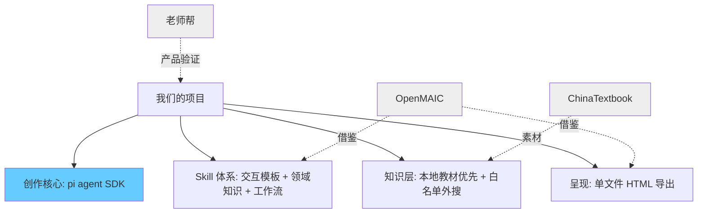

# 依赖资源调研（含 OpenMAIC 源码解读）

> 运行时不依赖 OpenMAIC。架构现状见 `docs/04-architecture-design.md`。

对三个参考项目做调研。其中 OpenMAIC 以**本地源码**为准，不只看 README。

---

## 1. 清华 OpenMAIC（源码级）

**仓库**：https://github.com/THU-MAIC/OpenMAIC  
**演示**：https://open.maic.chat/  
**本地已克隆**：`/Users/xing/VScode_workspace/OpenMAIC`（当前约 v0.3.1，MIT）

### 1.1 它实际是什么

OpenMAIC = **多智能体互动课堂生成平台**，不是「单考点原子教具工厂」。

核心能力：
- 主题/文档 → **两阶段生成**（大纲 → 场景）
- 场景类型：`slide` / `quiz` / `interactive` / `pbl`
- 多智能体讨论、白板、TTS/ASR、课堂回放
- 导出：PPTX / 交互 HTML / 课堂 ZIP（资源内联后可离线）

### 1.2 生成流水线（源码）

```text
用户需求 / PDF 材料
        ↓
Stage 1  outline-generator
        → SceneOutline[]（type + widgetType + keyPoints...）
        ↓
Stage 2  scene-generator
        → 完整场景内容
        · slide 内容
        · quiz 内容
        · interactive → 按 widgetType 选 prompt 生成 HTML
        · pbl 项目活动
        ↓
action 生成（老师讲解动作、高亮控件等）
        ↓
export（PPTX / HTML / classroom zip）
```

关键代码位置：
| 模块 | 路径 | 作用 |
|------|------|------|
| 生成类型 | `lib/types/generation.ts` | 两阶段类型定义 |
| 大纲生成 | `lib/generation/outline-generator.ts` | Stage 1 |
| 场景生成 | `lib/generation/scene-generator.ts` | Stage 2，含 widget HTML |
| 交互后处理 | `lib/generation/interactive-post-processor.ts` | LaTeX/KaTeX 注入 |
| 导出内联 | `lib/export/inline-assets.ts` | 外部资源 data URI 内联 |
| 课堂导出 | `lib/export/use-export-classroom.ts` | 离线课堂包 |
| Prompt 模板 | `lib/prompts/templates/*` | 各类内容生成提示词 |
| Widget 类型 | `lib/types/widgets.ts` | interactive 的细分类型 |

### 1.3 Interactive 不是一种，而是 6 种 Widget

源码 `WidgetType`：

| Widget | 适合 | 对我们的启发 |
|--------|------|--------------|
| **simulation** | 参数滑条 + Canvas/SVG 实时可视化 | 最接近我们的「参数图解」 |
| **diagram** | 流程图/思维导图/层级图 | 过程讲解、因果、步骤 |
| **game** | 真正可玩的 action/puzzle，不是假测验 | 低龄/益智/策略故事可参考 |
| **code** | 在线编程 + 测试用例 | 编程思维，非第一阶段 |
| **visualization3d** | Three.js 立体/分子/天体 | 立体展开/三视图可参考，但偏重 |
| **procedural-skill** | 步骤操作/流程技能 | 急救步骤、礼仪步骤可参考 |

`simulation-content` 模板已沉淀出硬约束：
- 自包含 HTML + `widget-config` JSON
- 滑条/预设/重置状态机
- 移动端控件不遮挡画布
- 触摸热区 ≥ 44px
- `postMessage` 监听（老师动作可遥控控件）

→ 这说明：**「固定交互契约 + LLM 填内容」**在 OpenMAIC 里已经验证可行。

### 1.4 Agent 层：已经在用 pi

源码 `lib/agent/VENDOR.md` 明确：
- 使用 `@earendil-works/pi-agent-core` + `@earendil-works/pi-ai`（钉死 0.78.0）
- **不用** pi 的 provider 实现 / TUI / coding-agent
- LLM 走 OpenMAIC 自己的 connector 适配层

仓库 `skills/openmaic/` 是 **OpenClaw 安装/生成课堂的 SOP Skill**，不是内容模板 Skill。

→ 和我们「创作核心 = pi agent SDK」方向一致，但 OpenMAIC 用它主要做**编辑/课堂侧 Agent**，不是我们定义的「原子教具创作主循环」。

### 1.5 导出 HTML 真正做了什么

- 互动场景 HTML 可单独导出
- 导出时把 KaTeX / Three.js / Tailwind CDN / 字体 / 图片尽量内联为 `data:` URI
- 目标：内网/离线可播，不依赖公网 CDN
- 失败资源保留原 URL 并记录

→ 这正是我们「电子白板打开就用」需要借鉴的实现，**但我们应更克制依赖**（尽量不引入 Three.js 级重量）。

### 1.6 对我们：保留 / 剔除 / 借鉴方式

#### 保留/借鉴（必要）

| 点 | 说明 |
|----|------|
| Interactive 分 widget 的思路 | 先定交互类型，再生成 HTML |
| simulation 交互契约 | 滑条 ID 规范、状态机、触摸尺寸、配置 JSON |
| HTML 后处理 | 公式渲染、资源内联 |
| 两阶段里的「先结构后内容」 | 我们可简化为：选 Skill 模板 → 填知识 → 出 HTML |
| 离线导出意识 | 白板场景必须自包含 |

#### 剔除（对我们过重）

| 点 | 原因 |
|----|------|
| 整课多智能体编排（LangGraph 导演） | 我们做单考点，不做整堂课讨论 |
| slide / quiz / PBL 全形态 | 前期只做单文件交互 HTML |
| TTS/ASR/圆桌/白板动作系统 | 教师课堂沉浸体验，不是原子教具核心 |
| 完整用户课堂回放平台 | 前期无平台交易/账号体系 |
| 3D / code playground 默认开启 | token 与复杂度高，非 MVP |

#### 明确关系（避免口径混乱）

```text
OpenMAIC = 参考实现 + 可借鉴模块（交互契约/导出/后处理）
pi agent SDK = 我们的创作调度核心
我们的产品 = 原子教具创作框架（不是再做一个 OpenMAIC）
```

**不是 fork 整仓重做**；必要时只抽取/改写：
1. interactive HTML 生成契约
2. 后处理与资源内联
3. simulation 类 prompt 结构

---

## 2. 老师帮 - AI课件平台

**地址**：https://www.laoshibang.com/courseware/index#/

### 已验证需求
- 数学概念可视化（面积推导、鸡兔同笼等）成立
- 「一句话生成 + 可分享交互」路径短
- 老师愿意为电子白板能直接用的互动页付费

### 和我们差异

| 维度 | 老师帮 | 我们 |
|------|--------|------|
| 用户 | 偏 B 端老师 | 家长 + 老师 + 创作者 |
| 架构 | 平台闭环 | 开放 Skill + pi Agent 创作 |
| 输出 | 更偏整课/课件 | 单考点原子 HTML |
| 变现 | 平台订阅 | 前期工具引流，创作者外部售卖 |

---

## 3. ChinaTextbook

**地址**：https://github.com/TapXWorld/ChinaTextbook

### 价值
- 全学段 PDF 教材素材索引
- 解决「课标知识点从哪对齐」

### 落地提醒（别写得太轻）
它是**素材库/索引**，不是开箱即用检索服务。要变成知识层还需：
- PDF 文本提取
- 切分/索引
- 版权边界（做交互讲解，不整本复制）

---

## 4. 裁剪后的依赖关系



---

## 5. 参考链接

- [OpenMAIC GitHub](https://github.com/THU-MAIC/OpenMAIC)
- [OpenMAIC 官网](https://open.maic.chat/)
- [老师帮 AI课件](https://www.laoshibang.com/courseware/index#/)
- [ChinaTextbook](https://github.com/TapXWorld/ChinaTextbook)
