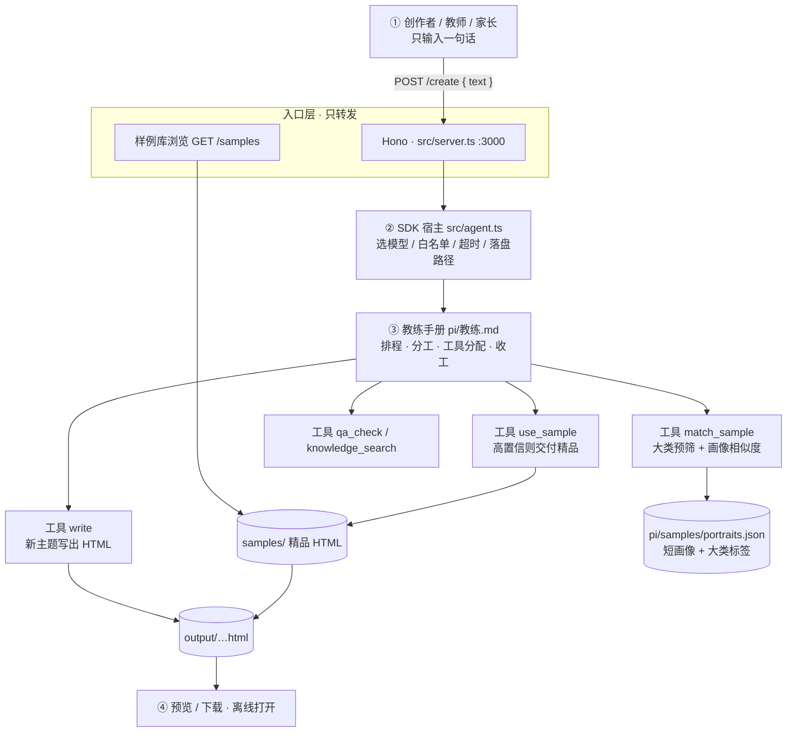
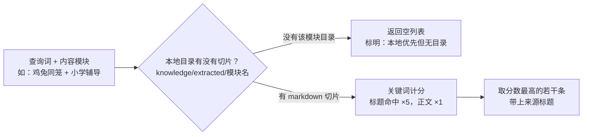
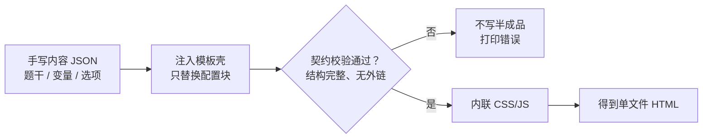
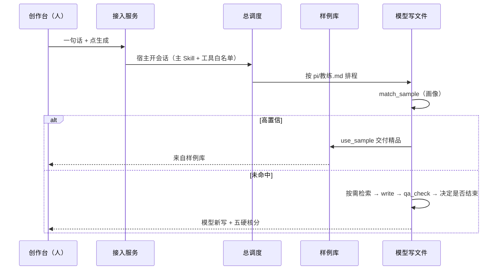

# 架构设计：以 pi agent SDK 为骨架

> 产品背景见 `01-product-overview.md`；生成 vs 样例见 `create-vs-samples.md`；离线图解手法见 `diagram-offline.md`；技术栈见 `specs/tech-stack.md`。  
> 给人审的流程与工具说明在 **`pi/`**。若与实现冲突：流程以 `pi/教练.md` 为准，宿主边界以 `src/agent.ts` 为准。

## 1. 一句话

**用户只输入一句话**；**教练手册**（`pi/教练.md`）指导排程与分工；各岗认定在 `pi/角色/`。  
Host（`src/`）只做接入、模型选择、工具白名单与安全边界。  
OpenMAIC 是参考实现，不是运行时依赖。

---

## 2. 总体架构（当前实现）

彩色可视化版本可打开 [`architecture-runtime.html`](./architecture-runtime.html)（浏览器直接打开即可）。

**怎么读这张图**

| 颜色 | 谁做主 | 中文一句话 |
|------|--------|------------|
| 蓝：前端 | 人 | 只说一句话，不选模块/类型 |
| 琥珀：宿主 | `src/agent.ts` | 开会话、限工具、守安全，**不编教学流程** |
| 教练 | `pi/教练.md` | 排程、谁上场、工具分给谁、何时结束 |
| 绿：案例工具 | `match_sample` / `use_sample` | 画像匹配；高置信才交精品 |
| 紫：写作 | `write` | 新主题直出单文件 HTML |
| 青：输出 | 浏览器 | 离线、白板可用 |

给人审的导航在 `pi/tools/README.md`（当前注入了哪些工具）。

---

## 3. 职责分工

| 角色 | 实际职责 | 不负责 |
|------|----------|--------|
| **`src/server.ts`** | 静态前端、健康检查、样例 API、转发 `{ text }` | 教学规划 |
| **`src/agent.ts`** | SDK 宿主：模型、超时、工具白名单、约定 outPath | 模块/类型表单、硬编码「是否命中样例」门闹 |
| **`pi/教练.md`** | 教练手册：排程、分工、工具分配、收工 | 写 HTML / 打五硬核细则 |
| **`pi/角色/`** | 各岗认定 + 允许工具 | 出场顺序 |
| **`pi/tools/`** | 工具导航 + 实现（match / use_sample / 检索 / 质检） | 宿主 if/else 业务 |
| **`pi/memory/`** | 人群、五硬核、教训（给人审） | 运行时隐式状态库 |
| **`samples/` + 画像** | 精品 HTML；`pi/samples/portraits.json` 短画像 | 弱关键词乱配 |
| **`skills/` 类型文** | 被主 Skill 按需引用的工艺附件 | 用户入口 |
| **契约链 inject/validate** | CLI / 测试旁路 | 线上 `/create` |

---

## 4. 运行时入口

启动：`npm start` → `node src/server.ts`（Hono + `@hono/node-server`，默认 `:3000`）。

| 方法 | 路径 | 行为 |
|------|------|------|
| GET | `/` | 每次读盘 `public/index.html`（`Cache-Control: no-store`） |
| GET | `/health` | `{ ok: true }` |
| GET | `/skills` | `loadSkills()`：扫描 `skills/` + `skills/creator/` |
| GET | `/samples` | 读 `samples/manifest.json`，补 `bytes` / 文件是否存在 |
| GET | `/samples/:file` | 仅允许 `[\w.-]+\.html` |
| POST | `/create` | body 必须有 `text`（或兼容旧字段 `topic`）。`module` / `skillId` 可选，**前端本阶段不展示** |

成功响应关键字段：`html`、`type`、`model`、`fromSample`、`sampleSlug`、`audience`、`quality`、`toolCalls`、`report`。

前端本阶段：**一个输入框 + 生成**。模块/类型由主流程推断，不当高级配置。

---

## 5. 创作主循环（Skill 规划 + 宿主守门）

### 5.1 用户与宿主

- 入参：一句话 `text`。  
- 宿主推断受众/类型，**仅作为提示**写进 user message，不据此切「样例门闹」。  
- 宿主开会话：注入 **`pi/教练.md` + `pi/memory/` + `pi/角色/_CORE.md`**，挂上 `pi/tools` 白名单。

### 5.2 教练手册（`pi/教练.md`）

1. 理解这一句话（隐含年龄/场景/题型）。  
2. 调 **`match_sample`**：大类标签预筛 → 画像计分；非高确信别名再走小模型比相似度。  
3. 高置信 → **`use_sample`** 交付精品。  
4. 未交付精品 → 教练 `read` `pi/ima/知识库目录.md`；对得上再 **`ima_search`**。本地与 ima 都不够时 **`web_search`**（建议 ≤2）。  
5. 写手按需本地 `knowledge_search`，再 **`write`** 完整 HTML。  
6. **`qa_check`**；不过则改写或重写。  
7. **Agent 决定结束 loop**：过检则停；多次不过则明确失败，禁止假成功。

### 5.3 案例匹配工具（不是代码硬门闹）

`pi/tools/match-sample.ts` + `pi/samples/portraits.json`：

- 每份精品一张**短画像** + **大类标签**（math / safety / english / preschool…）。  
- 先按标签缩小范围，再比用户句与画像的相似度。  
- 禁止单字/泛词乱配；禁止「同 type 第一份」。  

`CREATE_FORCE_LLM=1` 时主 Skill 跳过交付精品，仍可把匹配结果当参考。

### 5.4 宿主仍守住的边界（不写进随口改的流程）

1. `pickAgentModel`：会调工具的优先；避开 `fable` 等。  
2. **`maxTokens` ≥ 32000**。  
3. 工具白名单以 `pi/tools/README.md` 为准（含 `ima_search`；写手只用本地 `knowledge_search`）。  
4. 超时与「每轮新 session」防止卡死。  
5. 只接受本次 `outPath`；失败报错，不用旧 `output/` 冒充。  
6. 返回前 `inline` + 五硬核轻量打分（不挡下载）。

### 5.4 五硬核（生成约束 + 事后打分）

理解难度、形象性、图解清晰、逻辑一致、过程动态。  
前端展示分龄徽章与五硬核分。

---

## 6. `pi/` 目录（给人审的 SDK 层）

| 路径 | 作用 |
|------|------|
| `pi/教练.md` | 教练手册（唯一导演） |
| `pi/角色/` | 岗位认定 + 允许工具 |
| `pi/teams.yaml` | 花名册，不含顺序 |
| `pi/memory/` | 产品原则、教训 |
| `pi/tools/README.md` | 工具导航 |
| `pi/samples/portraits.json` | 精品短画像 |
| `pi/ima/` | 知识库目录 + 检索指南；`npm run ima:sync` |

类型工艺文仍在 `skills/{type}/SKILL.md`，由主流程按需 `read`，不是用户选的「高级配置」。

---

## 7. 知识层（已实现 vs 未接线）

说明：这是**独立可测**的检索，**默认没有挂进「生成教具」会话**（为了让模型先写得出来）。

| 项 | 现状 |
|----|------|
| 实现 | `src/knowledge.ts` `search()`；工具名 `knowledge_search`（`src/tools.ts`） |
| 数据 | `knowledge/extracted/` 下手写切片（如鸡兔/分数），非 PDF 教材库 |
| 模块 | `learning-coaching` / `preschool` / `safety-life` / `story-culture` |
| create 会话 | 已作为 `knowledge_search` 注入（写手按需）；ima 另走 `ima_search` |
| 公开网页 | 教练 `web_search`（pi-web-access `search()`，不挂整包扩展） |
| 腾讯 ima | 教练读目录后按需 `ima_search`；目录 `pi/ima/知识库目录.md` |

---

## 8. 加工旁路（契约链，非线上主路径）

早期 Phase 2 仍保留，供确定性测试与手写 content：

命令行等价：`content.json` → 注入 `templates/类型/v1/shell.html` → 校验 → 内联 → 落盘。

入口：`node src/cli.ts create-from-content --type … --content … --out …`  
以及 `tests/contract.test.ts`。

`qa_check`（`src/tools.ts`）可对任意 HTML 做外链/触控/结构检查；批跑见 `scripts/sample-qa-batch.mjs`、`sample-detect.mjs`。

---

## 9. 呈现层

只输出 **单文件 HTML**：

- CSS/JS 内联；禁止 CDN / 外链资源（SVG `xmlns` 除外）
- 图：emoji + 原生 SVG
- 结构约定：标题+年龄/场景、主交互、反馈、重置、「我怎么想」、「我会说」
- 分龄触控与字号见 `inferAudience`
- 目标设备：家庭平板、教室白板、培训巩固；断网可打开

样例库存量（`samples/manifest.json`）：约 **30** 份（param-visual 18 / drag-slot 7 / branch-story 5）。

---

## 10. 工具清单（以代码为准）

### create 会话实际挂上的

以 `pi/tools/README.md` 为权威清单，当前一般为：

| 工具 | 说明 |
|------|------|
| `match_sample` | 大类预筛 + 画像相似度 |
| `use_sample` | 高置信交付 `samples/{slug}.html` |
| `write` | 新主题写入本次 `outPath` |
| `read` | 读工艺文 / 样例参考 |
| `qa_check` | 写完自检 |
| `knowledge_search` | 本地切片检索 |

### 未实现 / 已废弃

| 名称 | 状态 |
|------|------|
| `get_schema` / `render_artifact` | 旧 Agent 填 JSON 路径，**已从 tools 删除** |
| FireCrawl MCP | 规划项，运行时未接线 |
| PDF 教材提取、公式渲染服务、向量检索 | 后置 |

---

## 11. 端到端时序

---

## 12. 源码地图

目录总览见 [`layout.md`](./layout.md)。

| 路径 | 作用 |
|------|------|
| `src/server.ts` | HTTP |
| `src/agent.ts` | SDK 宿主 |
| `pi/教练.md` | 教练手册 |
| `pi/tools/` | 工具导航与实现 |
| `src/knowledge.ts` | 本地检索实现 |
| `src/inject.ts` `validate.ts` `inline.ts` `io.ts` | 契约旁路 |
| `src/cli.ts` | create-from-content / validate / search |
| `public/index.html` | 创作 + 样例库 UI |
| `samples/` | 精品库 |
| `templates/*/v1/` | 旧壳 + schema，供 inject |
| `optimization/prompts/system.md` | 全文指挥官（可选） |
| `scripts/sample-*.mjs` | 样例检测 / QA / HTTP smoke |

`npm` 脚本：`start` / `test` / `qa-all` / `smoke-samples`。

---

## 13. 和 OpenMAIC 的边界

| 维度 | OpenMAIC | 我们（现状） |
|------|----------|----------------|
| 目标 | 整课多智能体课堂 | 单考点原子教具 |
| 生成 | 大纲→多场景 | 样例命中 **或** LLM 直出单 HTML |
| Agent | 编辑/课堂侧 | 仅未命中样例时 `write` |
| 输出 | PPTX + HTML + ZIP | 仅单文件 HTML |
| 重用 | — | 借鉴触控/内联，不整仓依赖 |

---

## 14. 阶段（对照 `specs/roadmap.md`）

| 阶段 | 状态（代码） |
|------|----------------|
| Phase 1 三模板手写契约 | 已完成（`templates/` + 测试） |
| Phase 2 inject/validate/inline | 已完成（CLI 旁路） |
| Phase 3 本地知识 grep | 已完成；未挂进 create 会话 |
| Phase 4 Agent + API | 已完成，但主循环已改为 write 直出 |
| Phase 5 前端入口 | 已完成（`public/index.html`） |
| Phase 6 样例包 | 约 30 份 + QA 脚本；实机白板待补记录 |
| Phase 7 创作者 Skill 扫描 | 目录可发现；旧 step 文案未跟新工具 |
| FireCrawl / 教材 PDF | 未做 |

---

## 15. 环境变量

| 变量 | 作用 |
|------|------|
| `PORT` | 服务端口，默认 3000 |
| `AGENT_MODEL` / `GMNCODE_MODEL` | 指定模型 id 或 `provider/id` |
| `AGENT_TIMEOUT_MS` | 单次 prompt 超时，默认 180000 |
| `AGENT_MAX_TOKENS` | 输出 token 下限，默认 32000 |
| `CREATE_FORCE_LLM=1` | 跳过样例命中 |

| `MATCH_SAMPLE_LLM=0` | 案例匹配跳过小模型，只用画像计分 |

---

## 16. 已知约束（实现教训）

1. 部分 Anthropic 模型（尤其 `claude-fable-5`）不调工具 → 永远无文件。  
2. `maxTokens` 过小会在 thinking 耗尽 → 必须抬到约 32k。  
3. 超时后同一 session 再 `prompt` 会 `already processing` → 必须新开会话。  
4. 宽松样例匹配 +「5 分钟内最新文件」会导致「输什么都一样」→ 已收紧并删除该兜底。  
5. 全文 skill + 读完整 sample 易超时；默认精简 prompt + write-first。

---

## 17. 下一步（相对当前代码）

1. 是否把 `knowledge_search` / `qa_check` 在 write 成功后再挂回（不影响首落盘）。  
2. 更新 `skills/creator/*/SKILL.md`，去掉 `get_schema` / `render_artifact` 旧步骤。  
3. FireCrawl / 真教材索引若要做，单独立项，不要画进已实现图。  
4. 补白板/平板实机验收记录（roadmap Phase 6 尾巴）。
